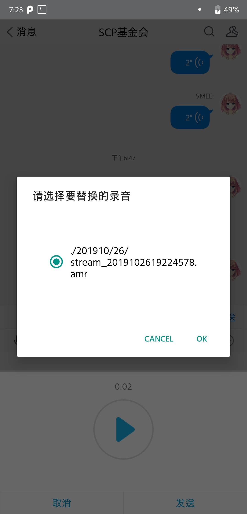

# TIMRec

通过监听文件变化并替换相应文件达到发送指定录音的效果。

为 TIM 打造，原理上同样适用于 QQ。

详情请查看[我的Blog](https://www.senventise.com/2019/10/26/TIM%E8%AF%AD%E9%9F%B3%E6%9B%BF%E6%8D%A2/)

## Install

1.安装 [Termux](https://f-droid.org/zh_Hans/packages/com.termux) 及 [Termux:API](https://f-droid.org/zh_Hans/packages/com.termux.api) 。

2.打开 Termux 并安装必要软件包

```bash
pkg install python3,git,termux-api
git clone https://github.com/senventise/TIMRec.git
cd TIMRec
```

3.配置

`config.py`为配置文件

`dialog`为dialog样式，`path`为 TIM 的录音存放目录，通常为`/sdcard/tencent/Tim/{你的QQ号}/ptt`

在 `amr` 目录下放上你想要替换的录音文件（必须转换为为 amr 格式）

## Usage

运行程序

```bash
python TIMRec.py
```

打开 TIM ，选择录音功能，点击录音，过2-3秒后停止录音，此时会弹出dialog，根据提示操作，然后点击发送。

## Screenshots




